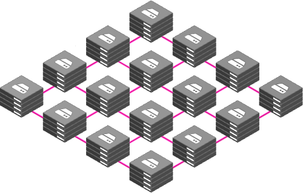

# Distributed Storage System
## Architecture

## Installation and Setup
### Prerequisites
- Python 3

##### The following user services are currently supported (with an option to modularly add new services at any time) - 

    1. File Upload (supports any file type - pdf, img, avi, txt, mp4, xml, json, m4v, etc.)
    2. File Download
    3. File Search
    4. File List (Lists all files on the system that belong to a specific user)
    5. File Delete
    6. File Update

This system allows many clients to have access to data and supports operations (create, delete, modify, read, write) on that data. Each data file is partitioned into several parts called chunks. Each chunk is stored on different remote machines, facilitating the parallel execution of applications.

#### Go to the project directory
```bash
cd DistributedStorageSystem
```
#### Give execute permissions to shell scripts
```bash
chmod 744 install_modules.sh generate_grpc_code.sh
```
#### Install modules
```bash
./install_modules.sh
```
#### Generate gRPC code
```bash
./generate_grpc_code.sh
```
#### Run Server
```bash
python3 node/server.py
```
#### Run Client
```bash
python3 node/client.py
```
## Steps to bring up the network
#### Start the first node of the network
```
python3 node/server.py 0 0
```
#### Adding nodes to the network
##### Start client and connect to any node in the network
```
python3 node/client.py 10.0.0.1
```
##### Start server after node is into the network
```
python3 node/server.py
```